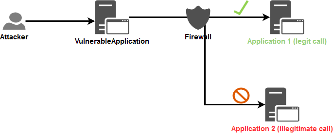

# Server-Side Request Forgery \[SSRF\]

## 1. Introduction.

 **Server-side request forgery** \(also known as SSRF\) is a web security vulnerability that allows an attacker to induce the server-side application to make **HTTP requests to an arbitrary domain** of the attacker's choosing.

 In a standard SSRF attack, the attacker might cause the server to make a **connection to internal-only services within the organization's infrastructure**. In other cases, they may be able to **force the server to connect to arbitrary external systems**, potentially leaking sensitive data such as authorization credentials.

A successful SSRF attack can often result in **unauthorized actions** or **access to data within the organization**, either in the vulnerable application itself or on other back-end systems that the application can communicate with. In some situations, the **SSRF vulnerability might even allow an attacker to perform** [**arbitrary command execution**](https://portswigger.net/web-security/os-command-injection)**.**


You can read more about SSRF [here](https://portswigger.net/web-security/ssrf).


## 2. Typical vulnerable code.

Here's an example of how and why SSRF vulnerability exists. Since the code below is opening the resource located on the given `$url` without being sanitized or checked whatsoever, the attacker can manipulate the server into **forging** a request to any URL they desire.



```php
<?php

    /**
    * Check if the 'url' GET variable is set
    *
    * Example request:
    *     http://localhost/?url=http://bobi.io/yakuhito.gif
    */
    if (isset($_GET['url'])){
        $url = $_GET['url'];
        
        /**
        * Send the request to the given
        * $url.
        */
        $image = fopen($url, 'rb');
        
        /**
        * Set the correct response headers.
        */
        header("Content-Type: image/png");
        
        /**
        * Return the content of the image.
        */
        fpassthru($image);
    }
...
```



Since there are some **legitimate reasons to make outbound requests** from your server, such as using any third-party APIs\(processing payments, error-reporting, etc\), we have to examine and find ways of defending against **SSRF.**

## 3. Mitigations.

### 3.1. Whitelisting HTTP requests domains.

An obvious first level of defense is setting up a whitelist for domains that you **KNOW** your application has to request.



```php
<?php
    # https://stackoverflow.com/questions/37069635/whitelisting-urls-in-php
    $whitelistDomains = [
        'safedomain.io',
        'anothersafe.com'
    ];
    
    function checkUrl($link, $whitelistDomains)
    {
    
        $urlData = parse_url($link);
    
        $domain = isset($urlData['host'])? $urlData['host'] : $link;
    
        if (in_array($domain,$whitelistDomains)){
            return true;
        }
        else{
            return false;
        }   
    
    }
    /**
    * Check if the 'url' GET variable is set
    *
    * Example request:
    *     http://localhost/?url=http://bobi.io/yakuhito.gif
    */
    if (isset($_GET['url'])){
        $url = $_GET['url'];
        
        /**
        * Validate the given url's domain
        */
        if(!checkUrl($url, $whitelistDomains)) {
            return;
        }
        /**
        * Send the request to the given
        * $url.
        */
        $image = fopen($url, 'rb');
        
        /**
        * Set the correct response headers.
        */
        header("Content-Type: image/png");
        
        /**
        * Return the content of the image.
        */
        fpassthru($image);
    }
...
```



This should still be avoided, since as previously mentioned you most probably already **KNOW** what domains you will be using for the API calls. Having said that, you can adapt your code to use the SDK\(software development kit\) for that API, or simply configuring the routes for those **API** calls in the code itself, rather than taking it from the `url` parameter.

### 3.2. Network-layer firewalls.

The objective of the Network layer security is to prevent your **VulnerableApplication** from performing calls to arbitrary applications. Only **allowed** _**routes**_ will be available for this application in order to **limit** its **network access** to only those that it should communicate with.

The Firewall component, as a specific device or using the one provided within the operating system, will be used here to define the legitimate flows.

In the schema below, a Firewall component is leveraged to limit the application's access, and in turn, limit the impact of an application vulnerable to SSRF:



Apart from this type of firewall, one can leverage **network segregatio**n. More to that [in here](https://www.f-secure.com/en/consulting/our-thinking/making-the-case-for-network-segregation).


You may still not be satisfied with the mentioned mitigations, should you work with a more complex system. Should that be the case, please read this[ comprehensive cheatsheet against SSRF](https://cheatsheetseries.owasp.org/cheatsheets/Server_Side_Request_Forgery_Prevention_Cheat_Sheet.html).



You can find more details about this topic here:

* [What is SSRF?](https://portswigger.net/web-security/ssrf)
* [Server Side Request Forgery Prevention \[OWASP\]](https://cheatsheetseries.owasp.org/cheatsheets/Server_Side_Request_Forgery_Prevention_Cheat_Sheet.html)


